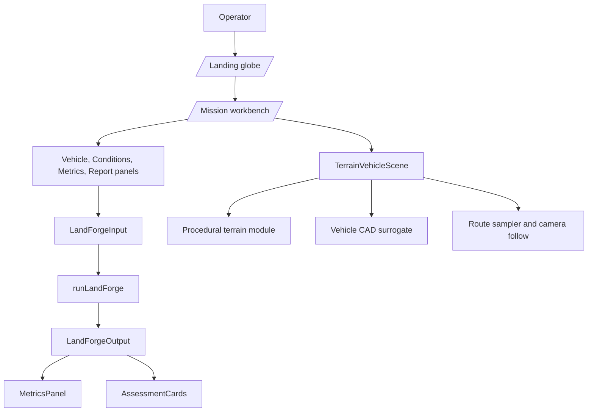
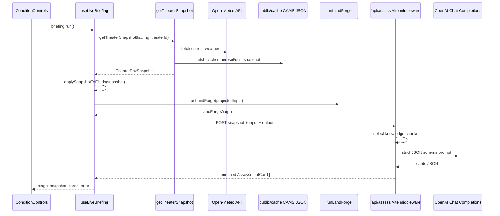
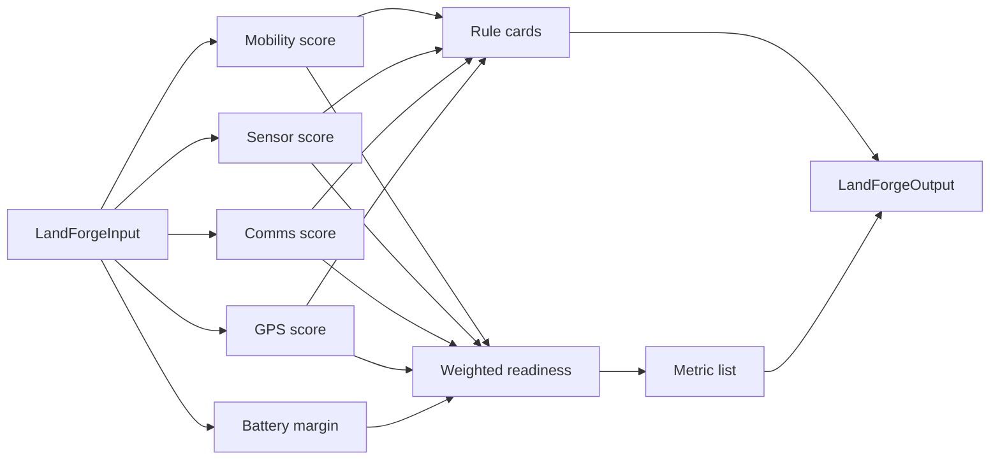
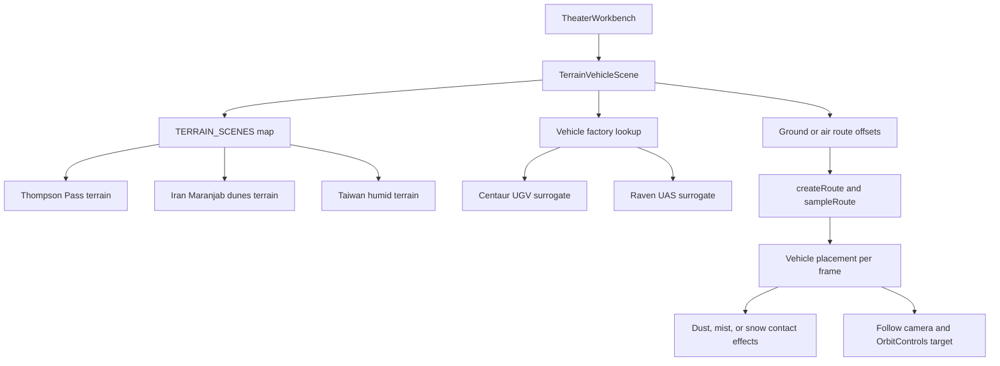
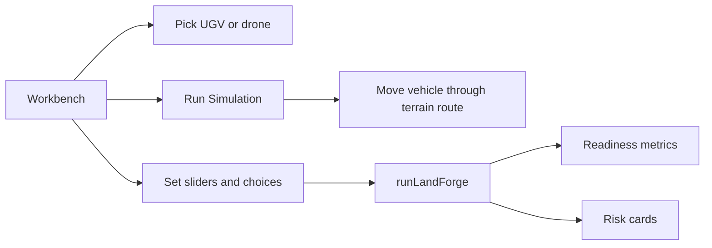
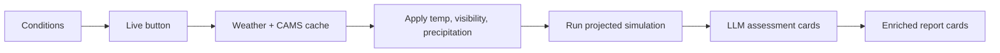
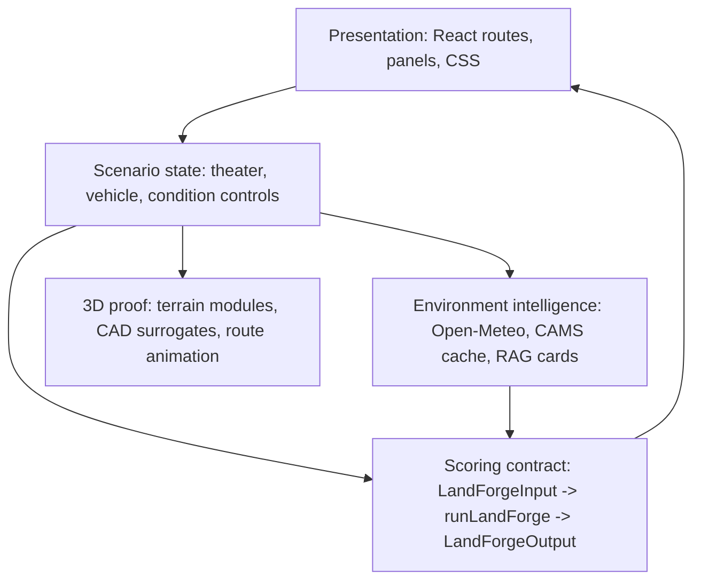

# LandForge Codebase Technical Breakdown

Date: 2026-05-05
Repo: `Sabalpp/HackSEC_SF`
Local checkout reviewed: `/Users/sabal/code/landforge`
Branch reviewed: `terrains`

## Executive Summary

LandForge is a Vite + React + Three.js application for pre-field autonomy readiness evaluation. The operator picks a theater, chooses a vehicle, changes environmental and mission conditions, and watches a vehicle move through a procedural terrain while the app converts those conditions into readiness metrics and assessment cards.

The core product is not a general game engine. It is a mission-readiness scoring surface:

1. Visualize the mission environment.
2. Convert terrain, weather, electromagnetic, and payload inputs into a stable `LandForgeInput`.
3. Run deterministic scoring through `runLandForge(input)`.
4. Display metrics and risk cards.
5. Optionally pull live weather/CAMS cache data and ask an LLM to rewrite the cards with physics-grounded explanations.

The most important seam is:

```ts
runLandForge(input: LandForgeInput): LandForgeOutput
```

Everything else exists to make that contract visible, interactive, and judge-legible.

## Runtime Architecture



## Live Briefing Flow

The live briefing path is the highest-value new integration on the branch. It adds real environmental data and LLM-backed assessment cards without changing the deterministic simulation contract.



## Data Contract

`src/sim/types.ts` defines the app's shared contract.

### LandForgeInput

The input contains five groups:

| Group | Fields | Purpose |
| --- | --- | --- |
| Theater and vehicle | `theater`, `vehicle` | Selects scenario identity and vehicle class. |
| Terrain | `surfaceFriction`, `slope`, `clutter` | Drives mobility and route stress. |
| Atmosphere | `visibility`, `airTemp`, `precipitation` | Drives sensor confidence and energy/thermal stress. |
| Electromagnetic | `gpsState`, `commsState`, `rfInterference` | Drives comms and navigation reliability. |
| Mission | `payloadKg` | Drives mobility and battery penalties. |

### LandForgeOutput

The output contains:

| Field | Meaning |
| --- | --- |
| `readinessScore` | Overall 0-100 mission readiness score. |
| `metrics` | Readiness, mobility, battery, sensors, comms, and GPS metric objects. |
| `cards` | Operator-facing assessment cards with severity, why, and action. |

This contract is intentionally simple. It lets UI, live data, and LLM enrichment evolve without breaking the central scoring seam.

## Simulation Flow

`src/sim/runLandForge.ts` is the deterministic scoring engine.



Current weights:

| Subsystem | Weight |
| --- | ---: |
| Mobility | 30% |
| Battery | 20% |
| Sensor confidence | 20% |
| Comms reliability | 20% |
| GPS reliability | 10% |

Hard caps:

| Condition | Effect |
| --- | --- |
| GPS denied and comms denied | Overall readiness is capped at 55. |
| Mobility score under 25 | Overall readiness is capped at 50. |

The scoring model is still rule-based. That is good for demo control: deterministic inputs create deterministic outputs. A later physics engine can replace the body of `runLandForge` while keeping the same input/output types.

## Route And 3D Scene Flow

`src/components/TerrainVehicleScene.jsx` integrates terrain, vehicle models, route sampling, effects, and camera follow.



Key ideas:

| Part | Description |
| --- | --- |
| `TERRAIN_SCENES` | Maps `arctic`, `hormuz`, and `taiwan` to scene factories and height functions. |
| `createVehicleModel` | Loads a CAD surrogate from `globalThis` and adapts the source model from Z-up to Three.js Y-up. |
| `createRoute` | Builds a closed route loop from fixed theater-local offsets. |
| `sampleRoute` | Samples position and tangent along the route by distance traveled. |
| `terrainNormalAt` | Samples nearby terrain heights to align UGVs to slopes. |
| `setForwardUpQuaternion` | Orients the model using route tangent plus terrain normal or drone bank. |
| `createContactEffect` | Emits points as snow/dust/mist during active simulation runs. |
| `frameCamera` | Places the camera around the initial target and lets it follow movement. |

The `runToken` prop is the animation trigger. The workbench increments `runToken` when the user clicks `Run Simulation`, and the scene uses that value to activate a time-boxed route run.

## Repository File Map

### Root Files

| Path | Role |
| --- | --- |
| `package.json` | Defines the app as a private Vite project with React, Three.js, react-globe.gl, and Tailwind/Vite tooling. |
| `package-lock.json` | Locked npm dependency graph. |
| `index.html` | Vite HTML entry. Loads the React app root. |
| `vite.config.js` | Registers React, Tailwind, path aliasing, port `4180`, and the local `/api/assess` plugin. |
| `vite-plugin-assess.js` | Dev-server middleware that safely calls OpenAI from Node instead of exposing `OPENAI_API_KEY` in the browser. |
| `tsconfig.json` | TypeScript config used by `.ts` sim, hook, and service files. |
| `.gitignore` | Ignores `node_modules`, `dist`, `.env`, `.env.local`, logs, and `.DS_Store`. |
| `README.md` | Short repo landing file. Updated to point at this breakdown. |

### React Entry

| Path | Role |
| --- | --- |
| `src/main.jsx` | Mounts React and the router. |
| `src/App.jsx` | Defines `/` landing route and `/mission/:theaterId` workbench route. Also owns the landing globe selection state and custom coordinate selection. |
| `src/styles.css` | Full app styling for landing page, workbench overlays, rail controls, panels, metrics, cards, terrain canvas, run button, and responsive behavior. |

### Data Catalogs

| Path | Role |
| --- | --- |
| `src/data/theaters.js` | Static theater definitions: Arctic Corridor, Hormuz Coast, Taiwan Highlands. Each theater has label, region, lat/lng, intro, stress type, and accent color. |
| `src/data/vehicles.js` | Vehicle definitions for UGV and drone. Supplies labels, summaries, chassis, mass, payload, and endurance. |
| `src/data/conditions.js` | Declarative condition field catalog. Controls render automatically from this file. Also defines default simulation inputs. |

### Simulation Contract

| Path | Role |
| --- | --- |
| `src/sim/types.ts` | The TypeScript contract for input, output, metrics, cards, theater IDs, vehicle IDs, and severity/tone values. |
| `src/sim/runLandForge.ts` | Rule-based readiness engine. Converts `LandForgeInput` into weighted subsystem metrics and assessment cards. |

### Hooks

| Path | Role |
| --- | --- |
| `src/hooks/useLandForge.ts` | Local simulation state hook. Builds defaults, syncs selected theater/vehicle, reruns `runLandForge` with `useMemo`, and exposes `setField` plus `reset`. |
| `src/hooks/useLiveConditions.ts` | Pulls a theater snapshot and maps defensible live fields into the sim input: temperature, visibility, and precipitation. Terrain, EW, and payload stay user-controlled. |
| `src/hooks/useLiveBriefing.ts` | Orchestrates the full live workflow: pull snapshot, apply fields, run projected sim, call LLM card generation, and expose stage/error/snapshot/cards state. |

### Environment Services

| Path | Role |
| --- | --- |
| `src/services/env/index.ts` | Combines Open-Meteo and cached CAMS data into one `TheaterEnvSnapshot`. |
| `src/services/env/openMeteo.ts` | Browser-safe Open-Meteo client for current temperature, humidity, wind, visibility, UV index, WMO weather code, and precipitation. |
| `src/services/env/cams.ts` | Reads static CAMS cache JSON from `public/cache/cams-{theater}.json` and converts AOD to a dust load bucket. |
| `src/services/env/types.ts` | Type definitions for Open-Meteo, CAMS, dust buckets, and assembled theater snapshots. |

### RAG And Assessment Services

| Path | Role |
| --- | --- |
| `src/services/rag/knowledgeBase.ts` | Hand-curated physics/degradation chunks. Uses deterministic trigger functions instead of embeddings. |
| `src/services/rag/prompt.ts` | System prompt, user prompt builder, and strict JSON schema for assessment card generation. |
| `src/services/rag/generateCards.ts` | Browser client for `POST /api/assess`. Validates that the response includes a `cards` array. |

### UI Components

| Path | Role |
| --- | --- |
| `src/components/LandingGlobe.jsx` | Full-screen globe selector using `react-globe.gl`. Handles preset markers, selected marker rings, custom click-to-coordinate drop points, and globe focus. |
| `src/components/TheaterWorkbench.jsx` | Main mission screen. Resolves theater/custom coordinates, owns vehicle selection and panel state, wires `useLandForge`, `useLiveBriefing`, `TerrainVehicleScene`, controls, metrics, and report cards. |
| `src/components/ConditionControls.jsx` | Renders default/live mode buttons and all condition sections from `CONDITION_SECTIONS`. Shows live pull stage, errors, and snapshot summary. |
| `src/components/MetricsPanel.jsx` | Renders metrics with numeric values and progress bars. |
| `src/components/AssessmentCards.jsx` | Renders green/yellow/red report cards with title, why, and action. |
| `src/components/VehiclePicker.jsx` | Renders selectable vehicle cards from `vehicleList`. |
| `src/components/TerrainVehicleScene.jsx` | Integrated terrain + moving vehicle scene. This is the main visual mission demo component. |
| `src/components/VehicleScene.jsx` | Older standalone vehicle viewer. Still useful as a simpler isolated vehicle render component, but the workbench now uses `TerrainVehicleScene`. |
| `src/components/Stars.jsx` | Landing page star field decoration. |

### Terrain Modules

| Path | Role |
| --- | --- |
| `src/terrains/thompson_pass_snow_topo_terrain.js` | Procedural Arctic/snow terrain inspired by Thompson Pass. Exports config, scene factory, elevation function, render-height function, and meter-to-lat/lon conversion. |
| `src/terrains/iran_maranjab_dune_fields_topo_terrain.js` | Procedural desert/dune terrain used for the Hormuz scenario. Exports the same terrain API. |
| `src/terrains/taiwan_humid_topo_terrain.js` | Procedural humid Taiwan terrain with foothills, wet pathing, trees, flowers, and fog. Exports the same terrain API. |

Every terrain module follows the same integration shape:

```ts
createXScene(container, options) -> {
  scene,
  camera,
  renderer,
  controls,
  dispose()
}

terrainElevationMetersAt(x, z) -> number
renderHeightMetersAt(x, z) -> number
metersToLatLon(x, z) -> { latitude, longitude }
```

That shared shape is why `TerrainVehicleScene` can switch theaters by changing a map entry instead of rewriting rendering logic.

### Public Terrain Previews

| Path | Role |
| --- | --- |
| `public/terrains/*.html` | Standalone preview pages for each procedural terrain. They load Three.js from unpkg through an import map. |
| `public/terrains/*.js` | Public copies of the terrain modules for standalone preview pages. |

The app imports the `src/terrains` copies. The `public/terrains` copies exist for direct browser previews such as `/terrains/thompson_pass_snow_topo_terrain.html`.

### Cached Environmental Data

| Path | Role |
| --- | --- |
| `public/cache/cams-arctic.json` | Stub/cache CAMS aerosol snapshot for Arctic. |
| `public/cache/cams-hormuz.json` | Stub/cache CAMS aerosol snapshot for Hormuz. Currently high dust load. |
| `public/cache/cams-taiwan.json` | Stub/cache CAMS aerosol snapshot for Taiwan. |

CAMS cannot be called directly from the browser due to auth and CORS. The cache files make the demo deterministic and browser-safe.

### Assets

| Path | Role |
| --- | --- |
| `src/assets/landforge-icon.png` | LandForge brand/icon asset used by landing and workbench headers. |
| `src/assets/cad/teledyne_flir_centaur_land/centaur_land_threejs.js` | All-in-one public-reference Centaur UGV Three.js surrogate. Attaches `CentaurLandThreeJS` to `globalThis`. |
| `src/assets/cad/rq11b_raven_air/rq11b_raven_threejs.js` | All-in-one public-reference Raven UAS Three.js surrogate. Attaches `RavenAirThreeJS` to `globalThis`. Includes `update(deltaSeconds)` for prop/flight animation. |

The CAD surrogates are non-operational visual/simulation approximations built from public information. They include metadata and optional collision/internal visual groups for future stress modeling.

### Scripts

| Path | Role |
| --- | --- |
| `scripts/fetch_cams.py` | Manual cache refresh script for CAMS dust/aerosol forecast data. Reads `CAMS_API_KEY` from environment or `.env.local`, writes `public/cache/cams-{theater}.json`. |

## API And Secrets

### OpenAI Assessment Proxy

`vite-plugin-assess.js` mounts a dev-only endpoint:

```text
POST /api/assess
```

Request body:

```json
{
  "snapshot": "... TheaterEnvSnapshot ...",
  "input": "... LandForgeInput ...",
  "output": "... LandForgeOutput ..."
}
```

Response body:

```json
{
  "cards": ["... AssessmentCard[] ..."],
  "usedChunks": ["kb-id"]
}
```

The plugin:

1. Loads `OPENAI_API_KEY` and optional `OPENAI_MODEL`.
2. Uses Vite `server.ssrLoadModule` to load the TypeScript knowledge base and prompt builder.
3. Selects triggered physics chunks.
4. Calls OpenAI Chat Completions with strict JSON schema output.
5. Returns cards to the browser.

`.env.local` is intentionally ignored by Git. Do not commit API keys.

### CAMS Cache Refresh

`scripts/fetch_cams.py` expects:

```text
CAMS_API_KEY=...
```

It also requires Python packages:

```bash
pip install cdsapi xarray netCDF4 requests
```

The script writes small static JSON files into `public/cache`. Those files are safe for the browser and can be committed when they are sanitized or demo-stubbed.

## Main User Flows

### 1. Start At Landing Globe

```mermaid
flowchart LR
    App[/ route] --> LandingPage
    LandingPage --> Markers[Preset theater markers]
    LandingPage --> Custom[Custom globe click]
    Markers --> Select[Select marker]
    Select --> Navigate[/mission/:theaterId]
    Custom --> NavigateCustom[/mission/custom?lat=...&lng=...]
```

### 2. Run A Mission



### 3. Pull Live Conditions



## Build And Development Commands

```bash
npm install
npm run dev
npm run build
npm run preview
```

The dev server is configured for port `4180`.

The OpenAI-backed assessment route works only during Vite dev unless a production serverless function is added with the same `/api/assess` shape.

## Current Branch State Before This Documentation

The reviewed `terrains` branch had unpublished changes in these areas:

| Area | Files |
| --- | --- |
| Live condition/briefing workflow | `src/hooks/useLiveBriefing.ts`, `src/hooks/useLiveConditions.ts`, `src/services/env/*`, `src/services/rag/*`, `vite-plugin-assess.js` |
| Terrain vehicle integration | `src/components/TerrainVehicleScene.jsx`, `src/terrains/*` |
| Workbench wiring | `src/components/TheaterWorkbench.jsx`, `src/components/ConditionControls.jsx`, `src/styles.css`, `vite.config.js` |
| Environmental cache/script | `public/cache/*`, `scripts/fetch_cams.py` |
| Theater coordinate update | `src/data/theaters.js` |

## Extension Points

| Goal | Where to work |
| --- | --- |
| Replace rule scoring with physics | Keep `LandForgeInput`/`LandForgeOutput`, replace internals of `runLandForge.ts`. |
| Add a new theater | Add `src/data/theaters.js` entry, add terrain module with the shared terrain API, map it in `TerrainVehicleScene.jsx`, add CAMS cache if live dust is needed. |
| Add a new vehicle | Add `src/data/vehicles.js` entry, add CAD factory asset, map it in `VehicleScene.jsx` and `TerrainVehicleScene.jsx`, tune altitude/speed/route scale. |
| Add new inputs | Add field to `LandForgeInput`, `CONDITION_FIELDS`, `CONDITION_SECTIONS`, defaults, and scoring logic. |
| Add better live data | Add a service under `src/services/env`, map only defensible fields in `useLiveConditions.ts`. |
| Productionize assessment API | Move `vite-plugin-assess.js` behavior into a real serverless or backend route. Keep `generateCards.ts` unchanged. |
| Add source-backed RAG | Replace the heuristic `selectChunks` function with embeddings or citation retrieval, but keep the prompt/schema contract. |

## Known Gaps And Risks

| Gap | Impact | Fix |
| --- | --- | --- |
| `runLandForge.ts` is rule-based | Good demo control, but not enough for scientific claims. | Swap in a better model behind the same contract. |
| OpenAI route is dev-server only | `vite preview` or static deploy will not have `/api/assess`. | Add a serverless function or backend route. |
| CAMS JSON currently includes stub timestamps | Demo-safe but not live-authenticated. | Run `scripts/fetch_cams.py` with a real key before serious demos. |
| Terrain modules are duplicated in `src/terrains` and `public/terrains` | Easy to drift. | Add a copy/build step or import previews from one canonical source. |
| Terrain routes are hard-coded offsets | Visually reliable but not operator-drawn yet. | Add route editor and serialize waypoints into sim input. |
| `runLandForge.ts` has a fog branch but `Precipitation` currently exposes only `none`, `rain`, `snow`, and `dust` | Harmless dead branch today, but it can confuse future edits. | Re-add `fog` to the type/control catalog or delete the branch. |
| `VehicleScene.jsx` is now mostly legacy | Can confuse maintainers because workbench uses `TerrainVehicleScene`. | Keep it as isolated viewer or remove after demos. |
| TypeScript and JSX are mixed | Works under Vite, but contracts are only partially typed. | Convert core components to TSX when the demo stabilizes. |

## High-Level Mental Model

Think about the codebase as five layers:



That is the real product flow:

```text
operator choices + live environment -> mission state -> readiness scoring -> visual proof + commander-readable report
```

The system wins when a judge can understand this in seconds:

```text
This route looks fine.
Turn on real weather/dust/GPS stress.
The score drops.
The vehicle run and report explain exactly where the mission is fragile.
```
